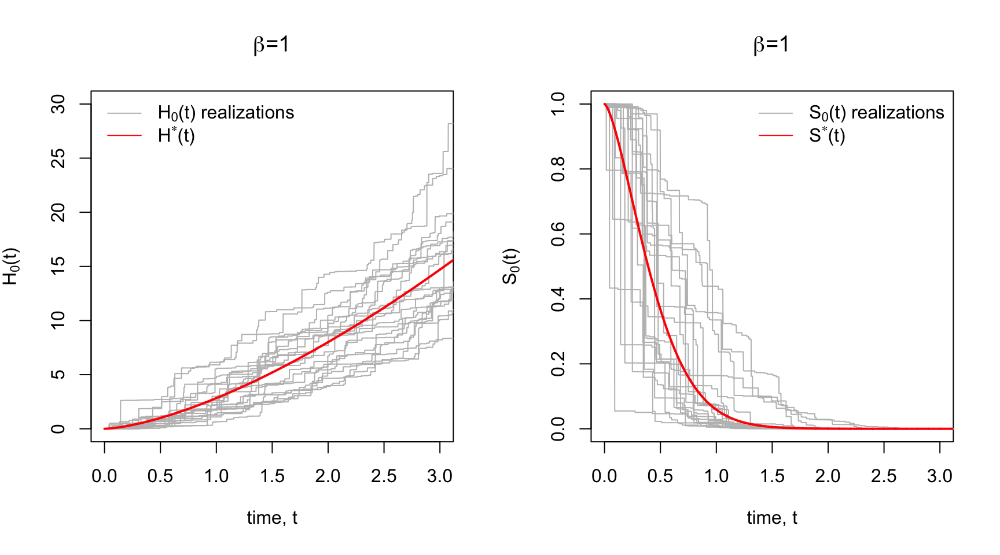

# Heart Attack Analysis & Prediction Dataset
Team members are Mark Sebastian, Sylvia Duan, Son Nguyen, and Tianyi Zhang
## Data
https://www.kaggle.com/rashikrahmanpritom/heart-attack-analysis-prediction-dataset
### Description
Heart attack have been the deadliest form of Heart diease ever known. Every year, about 805,000 Americans have a heart attack, and about 1 in 5 of these people have not aware of their symptoms. Also, it has been shown that about 17.9 million live have been taken away because of heart attack. As a result, we as a group plan on using dataset and information to predict, prevent, and manage heart attack rate. 

The dataset we used collects data among 13 attributes of a patient, including age, sex, chest pain type, resting blood pressure, concentration of serum cholesterol, concentration of fasting blood sugar, resting electrocardiographic results, maximum heart rate achieved, exercise induced angina or not, ST depression induced by exercise relative to rest, slope of the peak exercise ST segment, number of major vessels colored by flourosopy, thallium stress test results. These variables will be the explanatory variables in our AI model, and the predicted symptom of heart disease will be the response variable in the AI model.
### Importance of data
- Data among 13 attributes => technology: train an AI model to determine if the patient has heart attack by observing traits of the patient => if successful, we can know whether we have a heart attack based on known traits of ourselves (no community impact)
- Data among 13 attributes => technology: train an AI model to determine if the patient has heart attack by observing traits of the patient => if successful, the AI model can assist the doctor to make basic judgments in order to reduce the workload of doctors and enable further check-ups to be performed more timely (community impact)
## Benchmark
Existing models:
1. Cox Proportional Hazard (PH) models: The Cox proportional-hazards model is essentially a regression model commonly used statistical in medical research for investigating the association between the survival time of patients and one or more predictor variables. The Cox model is expressed by the hazard function denoted by h(t). Briefly, the hazard function can be interpreted as the risk of dying at time t. It can be estimated as follow:

*$h(t)=h_0(t)×exp(b_1x_1+b_2x_2+...+b_px_p)$

&nbsp; &nbsp; &nbsp; &nbsp;where, 
&nbsp; &nbsp; &nbsp; &nbsp;-$t$ represents the survival time 
&nbsp; &nbsp; &nbsp; &nbsp;-$h(t)$ is the hazard function determined by a set of $p$ covariates ($x_1$,$x_2$,...,$x_p$) 
&nbsp; &nbsp; &nbsp; &nbsp;-the coefficients ($b_1$,$b_2$,...,$b_p$) measure the impact (i.e., the effect size) of covariates 
&nbsp; &nbsp; &nbsp; &nbsp;-the term $h_0$ is called the baseline hazard. It corresponds to the value of the hazard if all the $x_i$ are equal to zero (the quantity $exp(0)$  
&nbsp; &nbsp; &nbsp; &nbsp;equals 1). The **$t$** in $h(t)$ reminds us that the hazard may vary over time.

